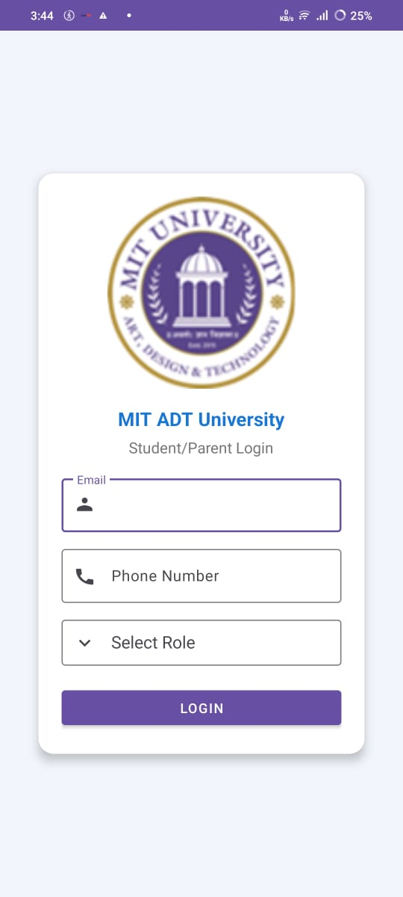
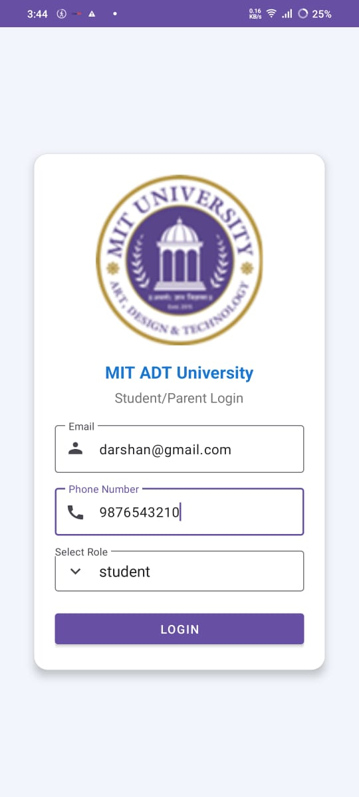
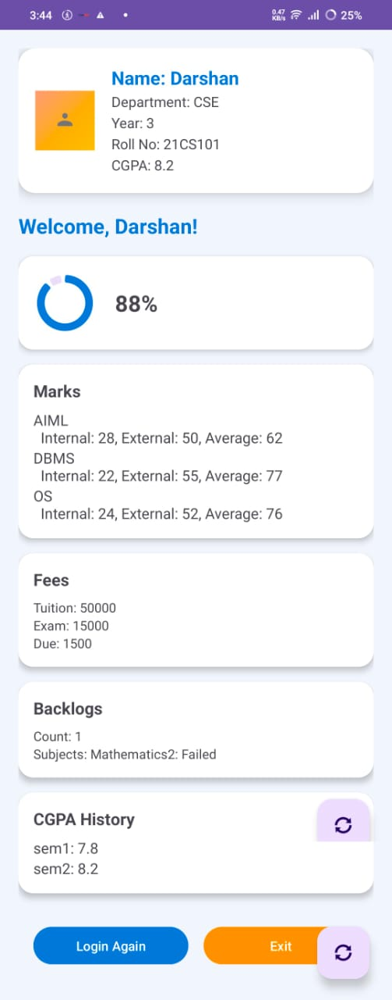
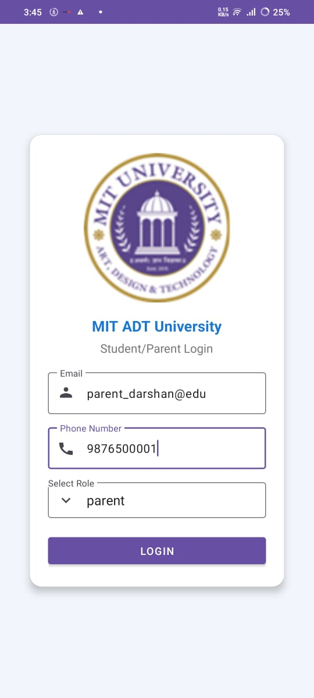
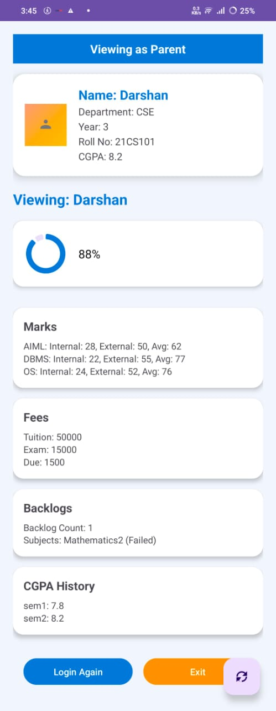

# MIT ADT Academic Progress Tracker App 📱🎓

A student/parent login-based Android application developed to track students' academic performance at MIT ADT University.

---

## 🔑 Features

- 🔐 Login for Students & Parents
- 📊 View marks, attendance, fees, and CGPA history
- 👨‍👩‍👧‍👦 Parents can monitor child's academic data
- 🔄 Real-time updates using Firebase
- 📤 Backend automation using Google Apps Script and Google Sheets

---

## 🔧 Technologies Used

- Java (Android)
- Firebase Realtime Database
- Google Apps Script
- Google Sheets

---

## 📸 App Screenshots

### 1. Login Page

### 2. Student Login

### 3. Student Dashboard

### 4. Parent Login

### 5. Parent Dashboard

---

## 🗂️ Folder Structure
MIT_ADT_Android_App/
│
├── app/ # Main Android source files
├── resources/ # Extra assets like screenshots
├── gradle/ # Gradle wrapper and config
├── .gitignore
├── build.gradle
├── settings.gradle
└── README.md # This file

## ✍️ Author

Darshan Patil  
MIT ADT University  
Email: darshanpatil1704@gmail.com

---

## ⭐ Show your support

If you found this project useful, consider giving it a ⭐ on GitHub!

